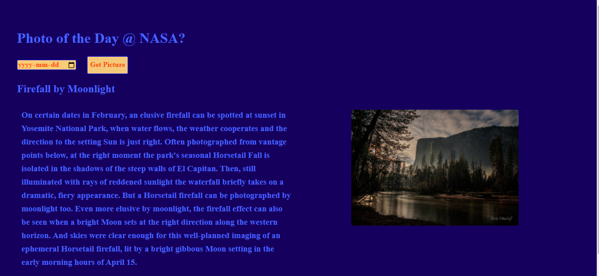

# 📊 Project:Simple NASA API 1

### Goal: Display data returned from an api

Build an application that allows users to input a date and view NASA's image/fact details of that day.

**Link to project: https://ddsimplenasa.netlify.app/ 

###  My Simple API Project
This project highlights my use of HTML, CSS and javaScript;an eye catching, informative application displaying semantically important content to the user.

## How It's Made:

**Tech used:** HTML, CSS, JavaScript

I utilized my skills in javaScript, HTML and CSS to include the use of API's paramteres into my functions and printing the results (depending on users choices)to the document.
## Lessons Learned:
I learned how to include videos into the DOM